# Katana Shop

Welcome to the **Katana Shop**, an immersive online store where users can browse and purchase legendary katanas. This application is built with **Ruby on Rails** and features a dark, medieval aesthetic with gold accents to match the Elden Ring theme.

## Features
- 🔑 **User Authentication** – Register, log in, and manage your profile.
- 🏆 **Admin Panel** – Manage stock, products, and user orders.
- 🔥 **Browse Katanas** – View a collection of legendary katanas with descriptions, prices, and images.
- 🛒 **Cart System** – Add katanas to your cart, update quantities, and remove items.
- 💳 **Checkout System** – Secure checkout process for placing orders.

## Images
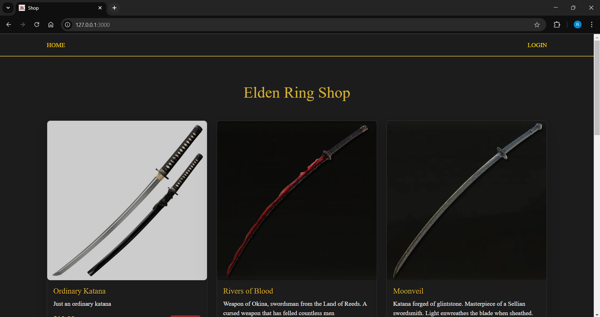
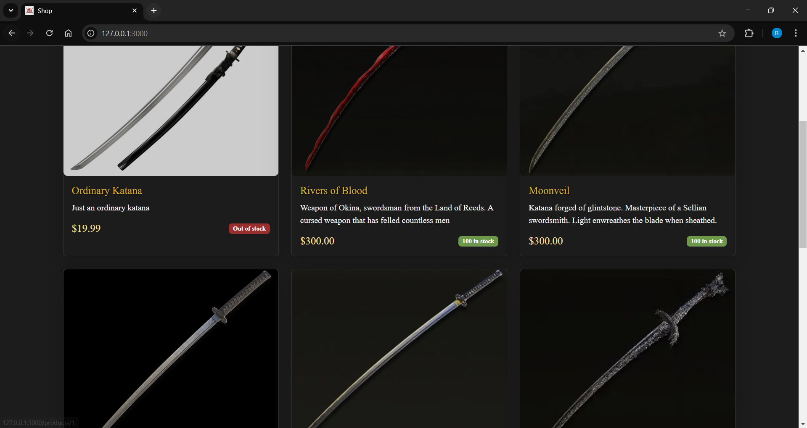
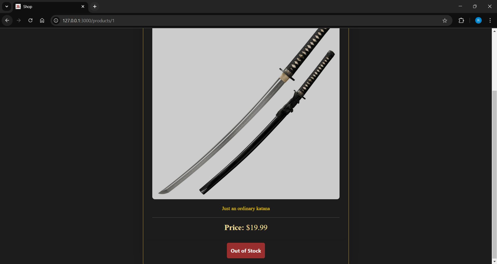
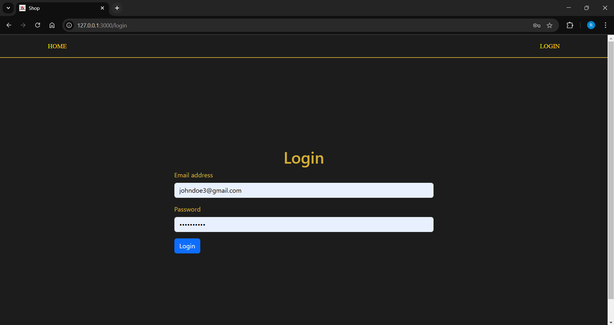
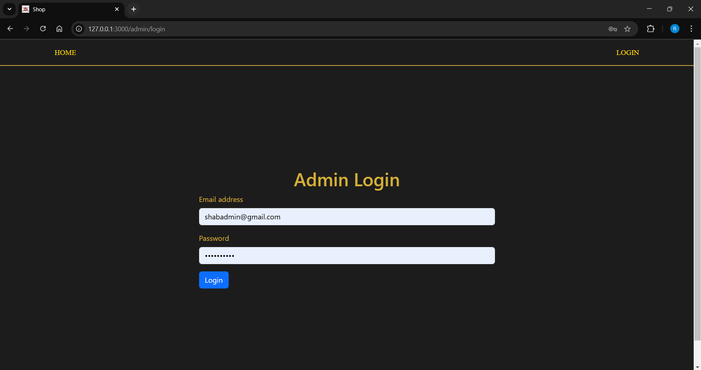
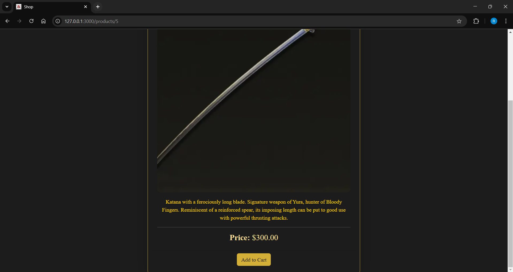
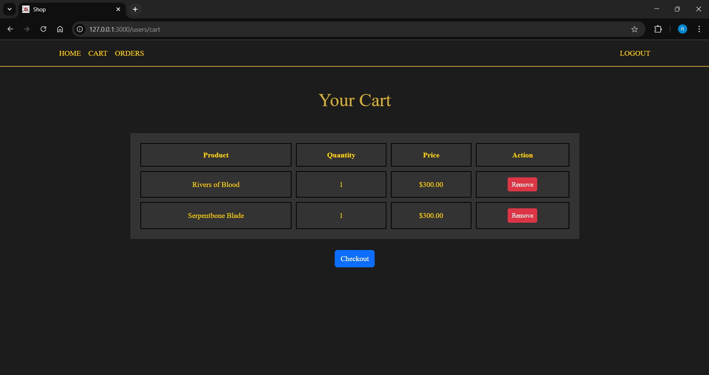
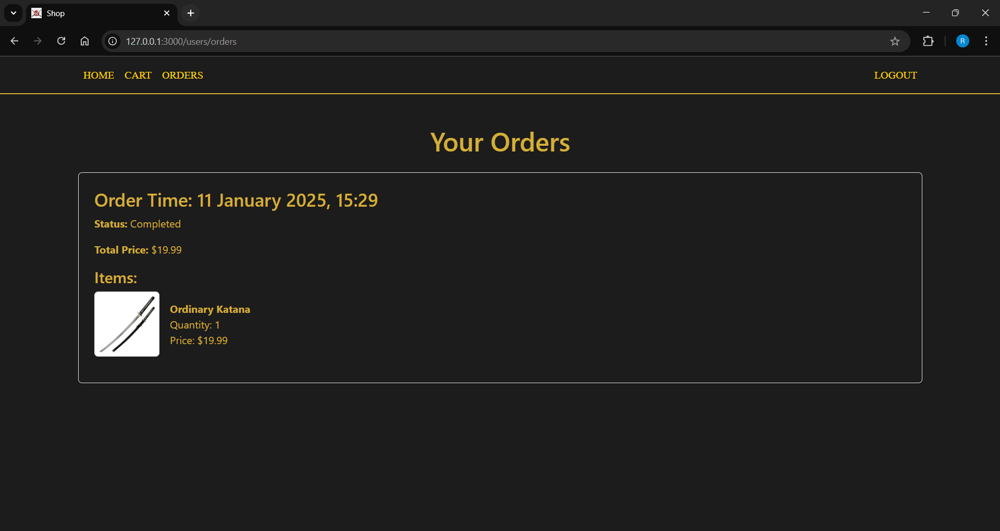
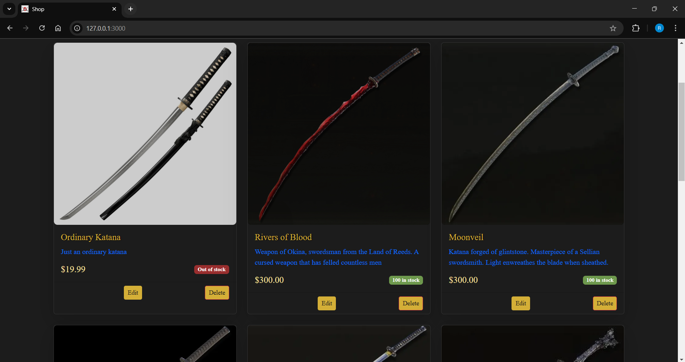
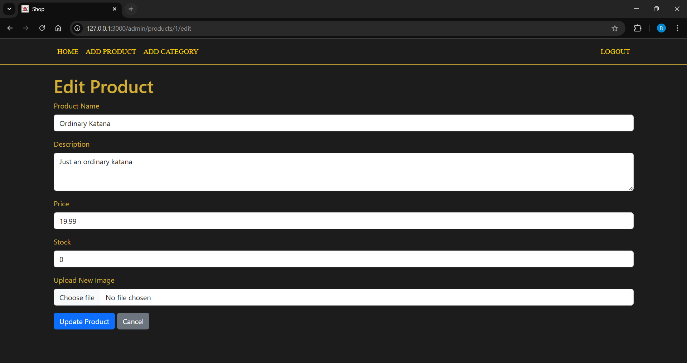
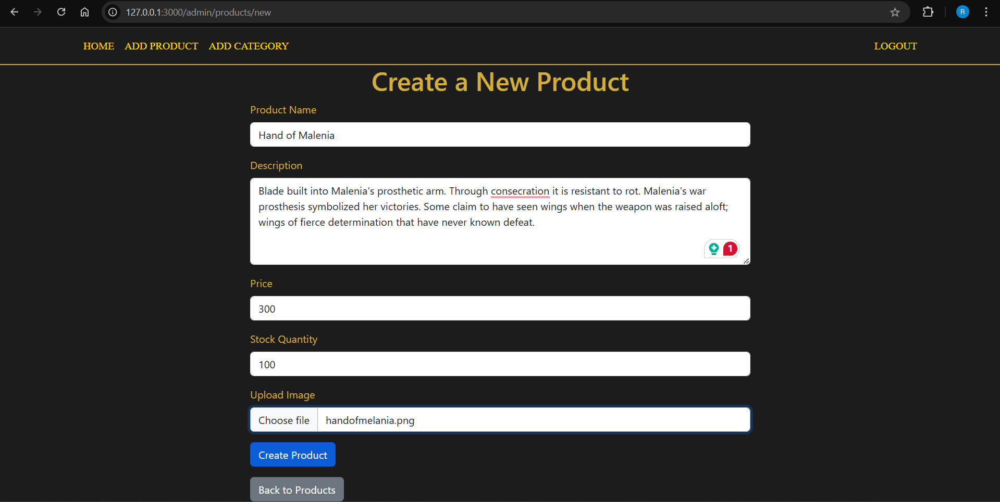
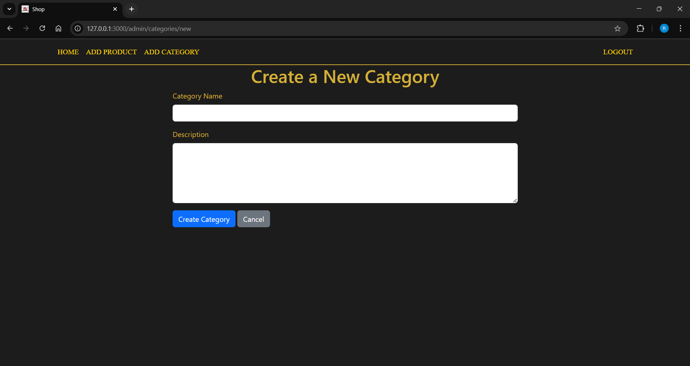